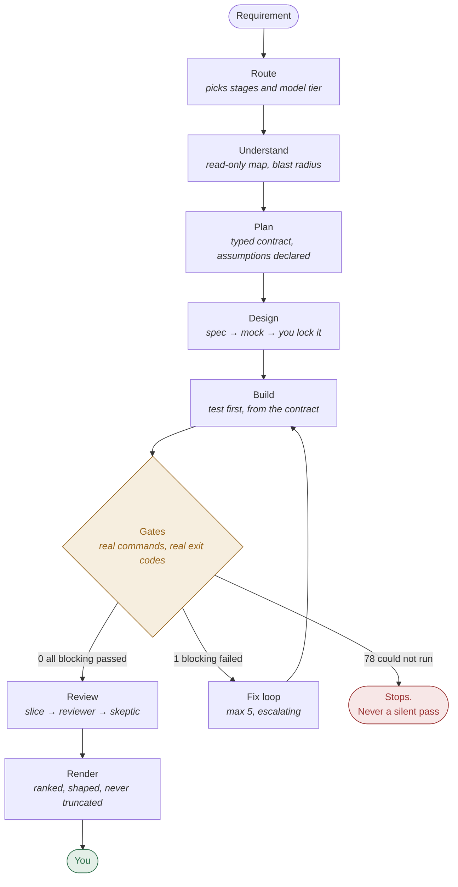
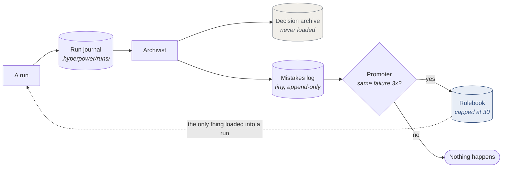

# hyperpower

An agentic development harness for Claude Code.

It runs a requirement through a gated pipeline, records what it decided and what it
assumed, and learns from repeated mistakes without making normal runs slower.

Stack-agnostic. One setup command adapts it to any repository.

## Install

```bash
claude plugin marketplace add https://github.com/adkaushik/hyperpowers
claude plugin install hyperpower@hyperpowers
```

Restart the session, then run this once per repository:

```
/hyperpower:init
```

`init` detects your stack, asks at most six questions, and writes `hyperpower.yml`. Budget
five minutes the first time.

## How it works

### The pipeline

One command drives one requirement to the end:

```
/hyperpower:run "add a settings screen"
```



Design runs on UI work only. Stages that do not apply are skipped &mdash; a one-file change
with a rulebook precedent runs Understand, Build, Gates, Review and nothing else.

Every stage writes a typed JSON contract, and the contract is checked against its schema
before the next stage reads it. A stage that cannot produce a valid contract stops the run
instead of handing the next stage prose it will misread.

The contracts land in `.hyperpower/runs/<run-id>/` while the run happens, not afterwards.
That folder is the record: what each stage decided, what it assumed, what every gate
printed, and every model call it made.

`/hyperpower:route "<requirement>"` prints the stage list it would use and writes nothing,
so you can see the cost before paying it.

### Gates execute commands

A gate runs a command from your config — `tsc --noEmit`, your test command, your build —
and reads the exit code. No model judgment.

A gate that cannot run says it did not run. A missing tool, a null command, a timeout: none
of those is a pass, and a blocking gate that did not run stops the run just as a failure
does. It never reports a pass it did not verify.

You choose which gates block and which only warn. Start `lint` as a warning and promote it
once the codebase is clean.

Nine gates are in the schema. Types, unit, lint, build and e2e run commands from your
config. Slop runs two static linters. Browser, a11y and visual check rendered output, so
they need a dev server, a route, and their own tooling before they check anything. Full
list in [docs/gates.md](docs/gates.md).

### A run is a folder, not a conversation

The run journal is written as the run goes: `meta.json`, one contract per step, the full
output of every gate command, a line per model call, and a line per failure event. Sessions
are disposable. The folder is not. You can resume any step days later, on another machine.

The run id comes from the base commit, not from a clock, so the same run has the same id
everywhere.

Resume re-hashes the working tree first and reports drift:

```
Resume run 4f2a from Gates.
  Understand   ok
  Plan         ok
  Build        DRIFTED — 3 files changed since this step
Re-run from Build instead? [build / gates-anyway / abort]
```

Without that check, a resumed run would review code that no longer exists.

### Assumptions are recorded, then checked

Every step records what it assumed. Nothing waits on you.

```json
{"id":"a1","claim":"settings API returns a bare array","source":"inferred",
 "confidence":"low","checkable":"src/api/settings.ts","status":"declared"}
```

At plan time that is a guess. By gate time the code exists, so a cheap model re-reads the
target and stamps the status: verified, refuted, or unresolved.

The refuted list is the useful one — assumptions that were wrong and shipped code anyway,
found without anyone reviewing anything.

```
/hyperpower:why 4f2a --assumptions
```

### Memory is two stores, not one

|  | Rulebook | Decision archive |
|---|---|---|
| Contains | how to behave in this repo | why things are the way they are |
| Size | capped at 30 rules | unbounded |
| Loaded | every run | never |
| Read | always | only when you ask |

The archive holds full decision records — options rejected and why, assumptions and their
outcome, what was tried and failed, the constraint that forced the choice. Markdown files
in `decisions/`, committed to your repo.

It costs nothing to keep, because it is never loaded into context.

When the same mistake happens three times, a background agent promotes it into the
rulebook, which every run does read. At the cap, the new rule must beat the weakest
existing rule, and that rule is demoted.

That cap is what keeps the harness from getting slower as it learns.



Everything left of the rulebook costs a run nothing. It happens after the work, on a cheap
model. Exactly one thing crosses back into a run, and it has a hard size cap.

### Five agents run after the work, not during it

| Agent | Writes |
|---|---|
| Archivist | decision records and the mistakes log |
| Promoter | rules, when a mistake crosses threshold |
| Gardener | compacts the archive, on command |
| Scout | opportunities you noticed but did not do |
| Janitor | dependency and migration debt |

None of them costs a normal run anything.

The scout has one rule that makes it useful: every entry cites evidence from the actual
work. No evidence, no entry. A backlog of generic AI ideas is worse than no backlog.

### Slop control is static first

`antislop` and `ai-slop-detector` run in the gate. Offline, about a second, zero tokens.
They catch placeholders, deferrals, hedging, stubs, redundant comments, unresolved imports
and clones.

A model sweep handles what static analysis cannot see: over-abstraction, code that works
but does not match how your repo does things, swallowed exceptions, invented helpers that
duplicate existing ones.

### Every prompt change is scored

Changing a prompt without measuring is how harnesses quietly get worse.

```
/hyperpower:eval
```

Blind A/B/C labelling against a weighted rubric. A change ships only when it has no
blockers, correctness and safety hold within 0.1 of baseline, and the weighted score beats
baseline.

Fifteen stack-neutral cases ship. Write your own against work you have read, then record
the baseline. Nothing generates cases from your commit history: a case taken from a commit
nobody reviewed is a baseline nobody trusts, and every later comparison inherits it.

## A session, end to end

A real ticket, the way someone who uses this daily would run it.

### 1. See the cost before paying it

```
/hyperpower:route "add rate limiting to /login"
```

```
task class   feature
stages       understand → plan → build → gates → review → render
             design skipped: no UI surface in scope
models       understand, review  →  mechanical
             plan, adjudication  →  judgment
why          touches an endpoint and its tests, more than one file, no rulebook precedent
```

Writes nothing. If the stage list looks wrong for the work, fix the routing table before
spending a run on it.

### 2. Run it

```
/hyperpower:run "add rate limiting to /login"
```

The run opens a folder and every stage writes into it as it goes:

```
run 4f2a  ·  base a3f19c2  ·  feature

  understand   ok    14 files mapped, 3 rulebook rules apply
  plan         ok    4 files, 2 tests first, 5 assumptions declared
  build        ok    tests written before code
  gates              types 0 · unit 0 · build 0 · lint 0 (warning)
  review       ok    2 findings → 1 CONFIRMED, 1 REFUTED
  fix          ok    round 1 of 5
  gates              types 0 · unit 0 · build 0
```

Gate results are exit codes, not opinions. `0` passed, `1` failed, `78` could not run.
**78 stops the run** &mdash; a gate whose tool is missing is not a pass.

### 3. Read what it guessed

This is the step most people skip, and it is where the value is.

```
/hyperpower:why 4f2a --assumptions
```

```
a1  refuted     inferred at plan · "the limiter store is in-process"
                contradicted by src/limiter/store.ts:34 — it is Redis-backed
a2  verified    from rulebook · "endpoint tests live beside the route"
a3  unresolved  no checkable target — needs a runtime probe
```

`a1` was wrong and shipped code anyway. Nobody reviewed anything to find that; the code
existed by gate time, so a cheap model re-read the target and stamped it.

### 4. Correct it once, permanently

```
/hyperpower:correct 4f2a plan a1 "the limiter store is Redis-backed, see store.ts" --scope forever
```

`forever` writes a rulebook diff for you to approve. The next run starts knowing it.

If your correction contradicts code the harness can read, it says so once and then obeys.
One challenge, bounded. You decide.

### 5. Hand-edit, then re-enter mid-pipeline

You fixed something yourself. Do not re-run from the top.

```
/hyperpower:resume 4f2a --from gates
```

```
Resume run 4f2a from Gates.
  Understand   ok
  Plan         ok
  Build        DRIFTED — 3 files changed since this step
Re-run from Build instead? [build / gates-anyway / abort]
```

It re-hashes the working tree first. Without that check a resumed run reviews code that no
longer exists. `gates-anyway` stays available because sometimes your edit *was* the fix.

### 6. The loop closes on its own

Three runs later, the same assumption gets refuted a third time. A background agent
promotes it into the rulebook without asking, and logs it:

```
/hyperpower:rules --recent
```

```
R18  Limiter state is Redis-backed, never in-process
     added 2026-09-08 · promoter · assumption_refuted ×3 · evidence: runs 4f2a, 51c9, 8b03
     evicted R04 (prevented nothing in 22 runs)
```

At the cap, a new rule must beat the weakest one. That is what stops the rulebook growing
until it slows every run down.

### 7. Check the bill and the record

```
/hyperpower:cost --since 7d --by stage
```

```
stage        calls   fresh in    cache read    out      cost
review          14     18,402       412,880   9,110    $0.71
plan             3     12,110        88,400   4,220    $0.24
understand       3      9,880        61,200   2,040    $0.11
                                                       ─────
                                                       $1.06
```

Cache reads sit in their own column because they dominate the token count and cost a tenth
of fresh input. A total that mixes them misreads the bill.

```
/hyperpower:visualize
```

Writes an HTML report of the whole session &mdash; every tool call, every agent and how it
ended, gate results, assumption outcomes, and the longest gaps in the timeline. Stays on
disk. Add `--redact` before sharing it.

## Power-user moves

Five things that separate daily use from first use.

| | |
|---|---|
| `/hyperpower:route` **before** every real run | Costs nothing, shows the plan. Wrong stage list is cheaper to fix here. |
| `/hyperpower:why --assumptions` **after** every run | The `refuted` list is wrong code that already shipped. |
| `--scope forever` on a correction you have made twice | Otherwise you retype it monthly. |
| `/hyperpower:rules --unused` **before** raising the cap | Raising `rulebook_max_rules` is the most common way to make the harness slowly worse. |
| `/hyperpower:review` on anything spanning subsystems | Partitions the diff, one reviewer per slice, one skeptic per finding. Findings come back CONFIRMED or PLAUSIBLE, and PLAUSIBLE is never dropped for want of a repro. |

Two more that run themselves and cost a run nothing:

```
/hyperpower:janitor      dependency and migration debt, from tools your repo already has
/hyperpower:scout        opportunities you noticed but did not do — every entry cites evidence
```

Both dedupe by key, so a repeat increments a counter instead of adding a row. That counter
becomes your priority order for free.

## Commands

Twenty-one commands in six groups. Full reference in [docs/commands.md](docs/commands.md).

```
/hyperpower:init            set up this repo
/hyperpower:doctor          check what is broken
/hyperpower:run "<req>"     drive one requirement to the end
/hyperpower:route "<req>"   print the stages it would run, and stop
/hyperpower:why <run>       what it decided and assumed
/hyperpower:resume <run>    replay from any step
/hyperpower:decisions       search the archive
/hyperpower:rules           show the rulebook
/hyperpower:scout           log opportunities
/hyperpower:janitor         log dependency debt
/hyperpower:usage           pass rates, fix-loop rounds, gate failures
/hyperpower:cost            tokens and money by stage
/hyperpower:review          partition, review, adjudicate
/hyperpower:eval            score a prompt change
/hyperpower:visualize       report what the agents did this session
```

## Configuration

`hyperpower.yml` at your repo root, committed. `hyperpower.local.yml` overrides it per
machine and is gitignored.

Everything the harness writes lives under one directory, `.hyperpower` by default. If your
repo already ignores somewhere, point it there instead of adding a `.gitignore` entry:

```yaml
paths:
  state: .claude/hyperpower
```

It sets which directories the harness may edit, which commands each gate runs, which gates
block, your two model tiers, and the limits.

You can write it by hand. `init` reads an existing file and only fills gaps.

Full schema in [docs/configuration.md](docs/configuration.md).

## Privacy

Nothing leaves your machine. There is no remote destination in the codebase, and no opt-in
that would create one. Usage and cost data are files inside your repository.

When `telemetry.redact_paths` is on, file paths are hashed before they reach an aggregate
view, so a report you paste somewhere carries digests instead of your directory names. The
per-run journal keeps the real paths, because it already lives in the repo it describes.

Redaction is not anonymity. The hash is salted from `.hyperpower/redact-salt`, so anyone
holding both the repo and that file can hash a path and match it. Add it to `.gitignore`
yourself — `init` does not.

```
/hyperpower:telemetry purge
```

Deletes all of it and tells you how many files it removed.

## Documentation

| Doc | Read it when |
|---|---|
| [Getting started](docs/getting-started.md) | First install |
| [Configuration](docs/configuration.md) | Editing `hyperpower.yml` |
| [Commands](docs/commands.md) | Looking up a flag |
| [Architecture](docs/architecture.md) | Understanding the internals |
| [Gates](docs/gates.md) | Adding or debugging a gate |
| [Analytics and privacy](docs/analytics.md) | Checking what is recorded |
| [Contributing](docs/contributing.md) | Adding a skill, gate, or agent |
| [Design spec](docs/design-spec.md) | The full long-form design |

## Credits

Built on work by other people, all MIT. See [ATTRIBUTION.md](ATTRIBUTION.md).

- [Superpowers](https://github.com/obra/superpowers) by Jesse Vincent — process skills
- [superflow](https://github.com/cashwanikumar/superflow) by Ashwani Kumar — handoff
  contracts, the bounded fix loop, the rulebook idea
- [i-have-adhd](https://github.com/ayghri) — output shaping and the eval runner shape
- [antislop](https://github.com/skew202/antislop) — the static slop linter in the gate

## Licence

MIT. See [LICENSE](LICENSE).
